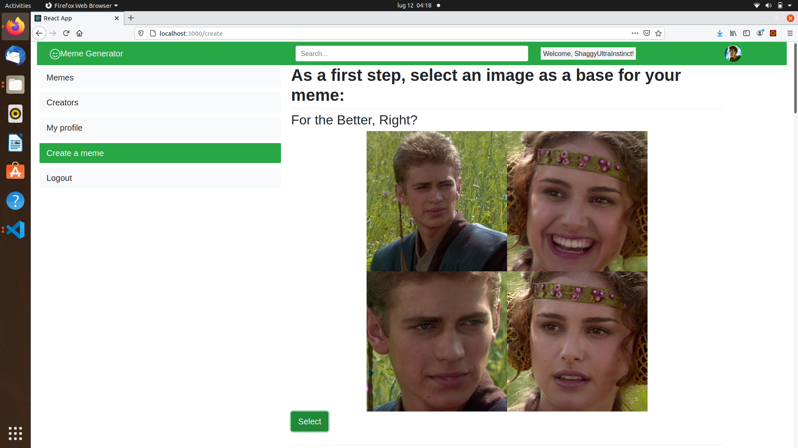
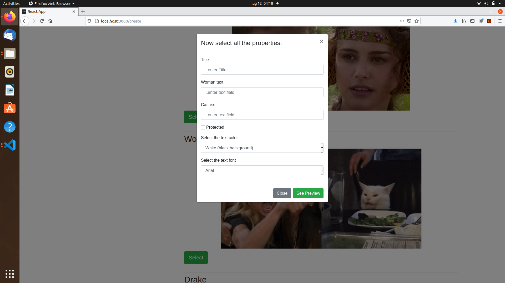
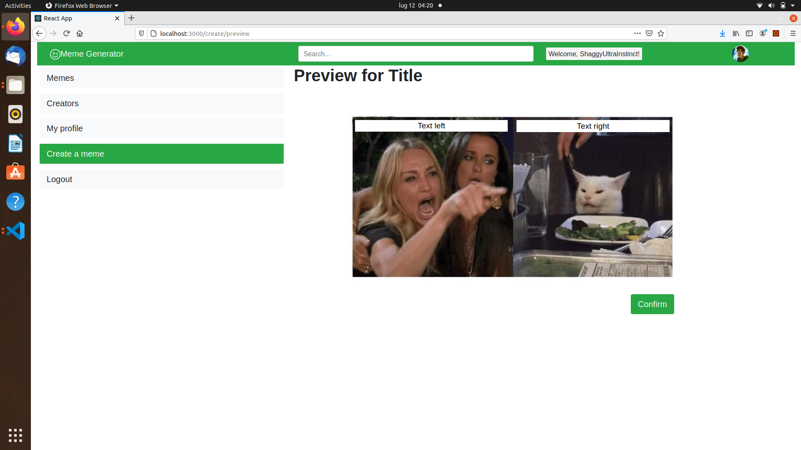
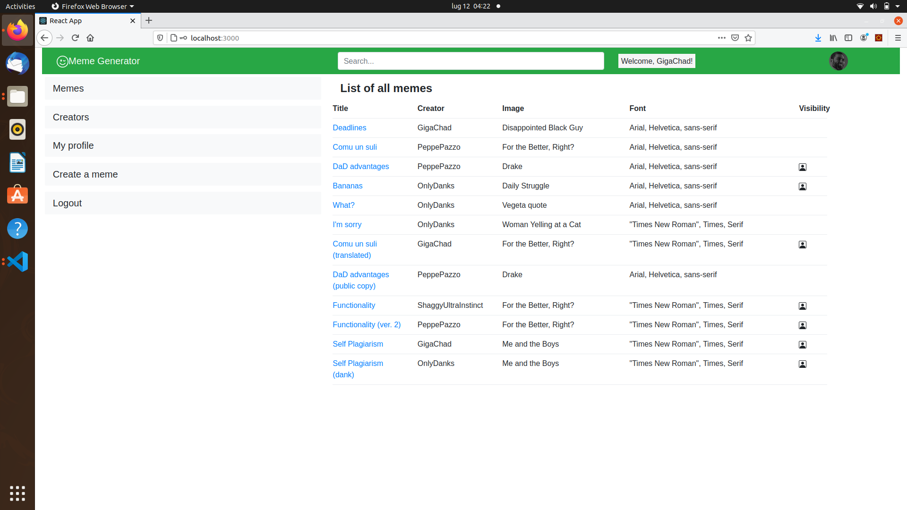
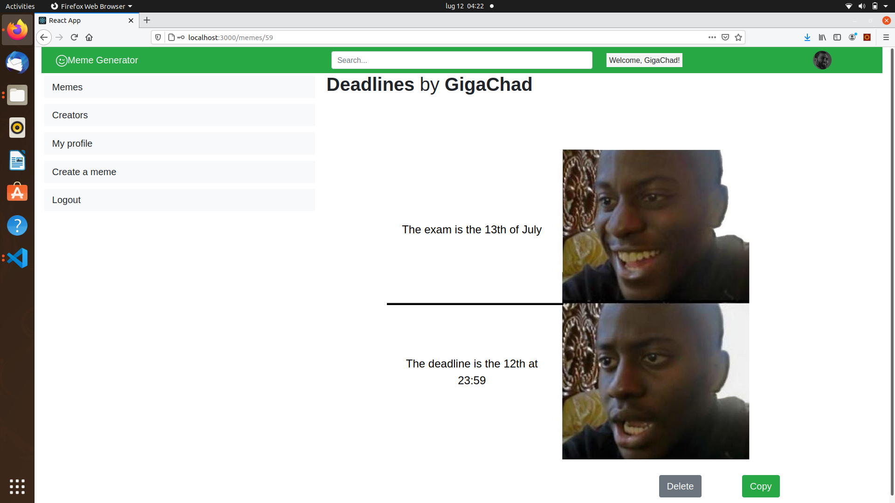
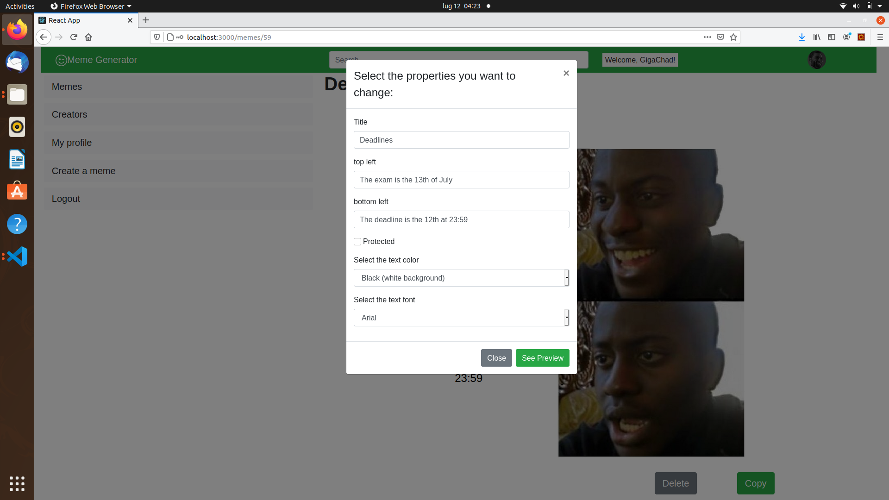
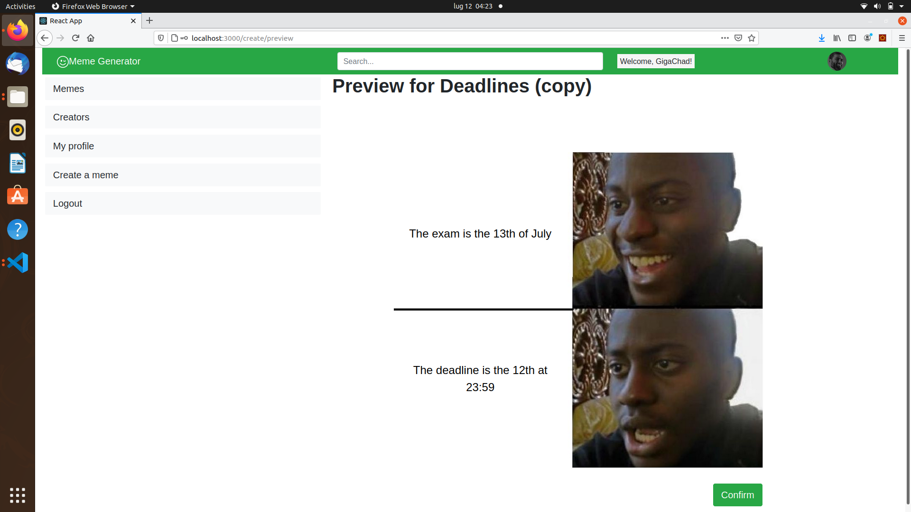

# Exam #2: "Meme Generator"
## Student: s288265 Blangiardi Francesco 

## React Client Application Routes

### All routes are in Utils.js, component MainRoutes

- Route `/`: main page, displays all visible memes (all if user is logged) with their main properties (no image or text fields)
- Route `/memes`: same as above (actually "/" route displays the memes only because it was specifically requested)
- Route `/memes/:id` : displays the meme identified by :id (with image and text fields). If meme does not exist or it is not visible it displays default missing page. From here users can delete or copy the meme, accordingly to their permissions
- Route `/creators` : displays the list of creators, with links to their profile pages
- Route `/creators/:id` : profile page of creator identified by :id, displays also their (visible) memes. Default missing page if creator doesn't exist
- Route `/create` : shows all available images. After one is selected, a modal appears where it's possible to fill the meme properties
- Route `/create/preview` :  after /create or copy modal is submitted, you get redirected to this route where you can visualize the meme before storing it into the db. Should not be accessible in any other way (you get redirected)
- Route `/login` : simple form to login
- Route `*` : any route that doesn't match the above ones displays a default "missing page" message (should not be accessible  directly from application)

## API Server

- GET `/api/session`
  - request parameters : none
  - response body content : returns information about the logged user (id, username and profile picture id). Error message if unauthenticated
- POST `/api/login`
  - request parameters: none - bodycontent: an object with keys "username" and "password"
  - response body content : an object with keys "id", "username" and "pfp_id" (profile picture id). Error message if username or password don't match
- DELETE `/api/logout`
  - request parameters: none - bodycontent: none
  - response body content : an object with keys "id", "username" and "pfp_id" (profile picture id) 
- GET `/api/memes`
  - request parameters : none
  - response body content : list of all meme objects (id, title, creator name and id,visibility, font, color, id of the image. Text fields are not retrieved here). If user is not logged, only public memes are retrieved 
- GET `/api/memes/:c_id`
  - request parameters : c_id is the id of a creator
  - response body content : same as /api/memes, but only retrieves the meme belonging to creator with id = c_id. Gives an error message if c_id does not identify a creator or if such creator does not have any (visible) memes.
- GET `/api/creators`
  - request parameters : none
  - response body content : list of all creators registered in application. Each entry in list contains the fields: c_id, username, pfp_id, quote (a description) 
- POST `/api/addMeme`
  - request parameters: none - bodycontent: an object representing a meme and its text fields: title, imageId, visibility, font, color and fields (array of text fields). Creator's name and id are deduced from the logged user. This request stores the meme and its text fields in the db
  - response body content : the id of the newly created meme. Error message if unauthenticated (meme and fields are not stored)
- DELETE `/api/deleteMeme/:id`
  - request parameters: the id of the meme we want to delete from db - bodycontent: none
  - response body content : none
 - GET `/api/retrieveMeme/:id`
  - request parameters : id of the meme we want to retrieve
  - response body content : an object representing a meme along with its text fields. Error message if the meme does not exist or if it is not visible
- GET `/api/retrieveCreator/:id`
  - request parameters : id of the creator we want to retrieve
  - response body content : an object representing a creator (id, username, pfp id and quote). Error message if the creator does not exist

## Database Tables

- Table `CREATORS` - each entry represents a creator. Fields are : c_id (creator id), username, hash (hash of the password),pfp_id (id of the profile picture), quote (a description).
- Table `MEME` - each entry represents all properties (except text fields) of a meme. Fields are: id, title, imageId (id of the image used for the meme), visibility, font (as int), color (as int), c_name (username of the creator), c_id (id of the creator).
- Table `TEXTFIELDS` - each entry represents a text field for a meme. Fields are : meme_id, field_id (position in the field array), field (the actual text). Informations about text field positioning are contained in client side

## Main React Components

- `MemeBody` (in `Utils.js`): wrapper for the whole application (together with App, which calls it). 
- `MemeSide` (in `Utils.js`): called by MemeBody, it is a menu from which the user can access the main routes (also login and logout)
- `MainRoutes` in (Utils.js): called by MemeBody, renders all the routes of the application
- `MainList` (in `MemeComponents.js`): as all exports of MemeComponents, it is colled by MainRoutes. Displays main list of memes (no textfields)
- `CreatorsList` (in `MemeComponents.js`): displays the list of creators with links to their pages
- `CreatorsPage` (in `MemeComponents.js`): displays the profile page of a creator along with the list of their memes
- `MemePage` (in `MemeComponents.js`): displays a page with a given meme (along with its image and text fields) and possible buttons to copy and delete. It does it by calling MemeComponent
- `ImageList` (in `MemeComponents.js`): displays the list of available images to create a meme
- `MissingPage` (in `MemeComponents.js`): displays a default "page not found" message. Either called by MainRoutes or by MemePage and CreatorPage when the related item could not be retrieved
- `CreateModal` (in `Modals.js`) : a modal containing a form for creating a meme after selecting its image. The api call for storing the meme is performed elsewhere (component MemePreview)
- `CopyModal` (in `Modals.js`) : similar to CreateModal, but is changed accordingly with the meme we want to copy, its visibility, and wether the logged user owns it.

### other important files
- `Meme.js` : contains the Image class and export informations (name, location, text field locations etc.) of the various available images through variables ImagesData and SupportPictures 
- `Contexts.js` : contains the only context I used in the application (related to the logged user). The only provider is App
- `LoginComponent.js` : contains a form to login into the application. Called by MainRoutes
- ...

(only _main_ components, minor ones may be skipped)

## Screenshot

### Create: from main select Create a Meme

### -> Select

### -> See Preview

### Copy: from main or /creators/:id -> click on a meme

### -> Copy

### -> See Preview

### -> Confirm

## Users Credentials

format is "username", "password"

- GigaChad, asd
  - "Deadlines"
  - "Comu un suli (translated)" : copied from "Comu un suli" by PeppePazzo
  - "Self Plagiarism"
- PeppePazzo, asd
  - "Comu un suli"
  - "DaD advantages"
  - "DaD advantages (public copy)": copied from "DaD advantages" but with different visibility
  - "Functionality (ver. 2)" : copied from "Functionality" by ShaggyUltraInstinct
- OnlyDanks, asd
  - "Bananas"
  - "What?"
  - "I'm sorry"
  - "Self Plagiarism (dank)" : copied from "Self Plagiarism" by GigaChad
- ShaggyUltraInstinct, imsostrong
  - "Functionality"
